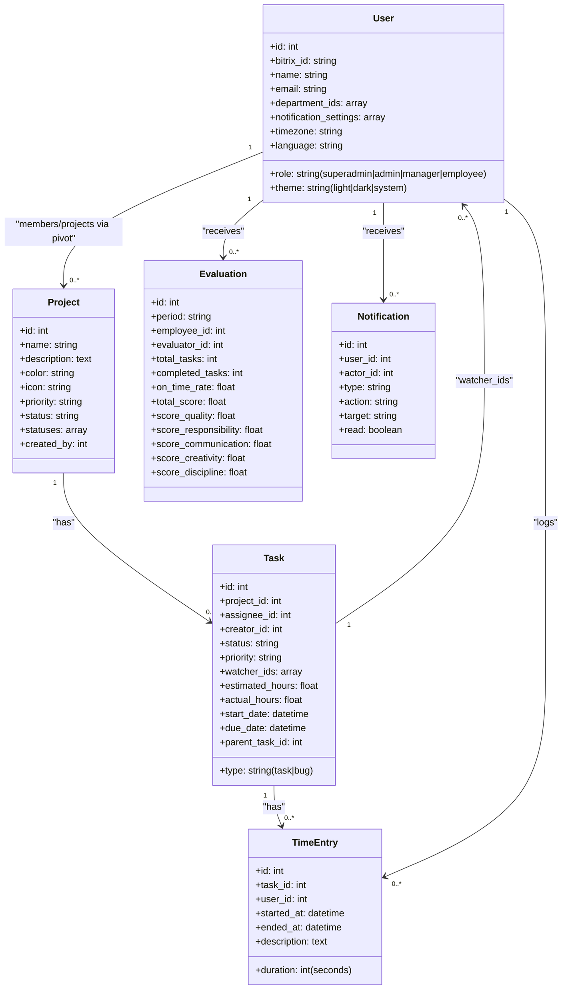
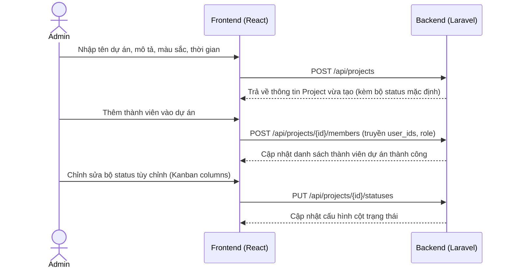

# TÀI LIỆU TRAINING AI: TOÀN BỘ KIẾN TRÚC & QUY TRÌNH DỰ ÁN TASKFLOW

Tài liệu này được biên soạn để cung cấp cho bất kỳ AI Agent nào một cái nhìn toàn diện, chi tiết từ cơ sở dữ liệu, các hàm xử lý logic nghiệp vụ ở Backend (Laravel), giao diện Frontend (ReactJS + Ant Design), cho đến các luồng nghiệp vụ chạy thực tế của hệ thống **TaskFlow**.

Hệ thống TaskFlow là một ứng dụng quản lý công việc và hiệu suất dự án nâng cao, đồng bộ nhân sự từ Bitrix24 và tích hợp chấm công (Timesheet), đánh giá hiệu suất nhân viên (Evaluations) cùng với trợ lý ảo AI.

---

## 1. TỔNG QUAN HỆ THỐNG & CÔNG NGHỆ CHỦ CHỐT

* **Backend**: Laravel Framework 11, sử dụng Laravel Sanctum để xác thực API, Laravel Echo để phát thông báo/đồng bộ sự kiện thời gian thực (Real-time).
* **Frontend**: ReactJS 18, TypeScript, Ant Design làm UI framework, Recharts vẽ biểu đồ, SCSS quản lý phong cách thiết kế cao cấp (Premium Dark Mode chủ đạo).
* **Đồng bộ Bitrix24**: Hệ thống đồng bộ dữ liệu User, phòng ban (Departments), chức danh trực tiếp qua Bitrix REST API. Xác thực SSO qua callback.

---

## 2. CHI TIẾT CƠ SỞ DỮ LIỆU & CÁC RELATIONSHIPS (BACKEND MODELS)

Dưới đây là cấu trúc các Model cốt lõi trong hệ thống:

### 2.1. Model `User` (`app/Models/User.php`)

* **Các trường chính**: `id`, `bitrix_id`, `name`, `first_name`, `last_name`, `email`, `phone`, `photo`, `role` (`superadmin`, `admin`, `manager`, `employee`), `active` (boolean), `department_ids` (array), `work_position`, `theme` (`light`, `dark`, `system`), `timezone`, `language` (`vi`, `en`, `ja`), `workspace_name`, `notification_settings` (array).
* **Quan hệ**:
  - `projects()`: BelongsToMany `Project` qua bảng trung gian `project_members`, lưu thêm cột pivot `role` (`manager` hoặc `member`).

### 2.2. Model `Project` (`app/Models/Project.php`)

* **Các trường chính**: `name`, `description`, `color`, `icon` (lưu class biểu tượng Antd Outlined hoặc tệp Base64 data URL của avatar dự án), `priority` (`low`, `medium`, `high`), `status` (`planning`, `active`, `completed`, `on_hold`), `statuses` (mảng các trạng thái công việc tùy chỉnh), `start_date`, `end_date`, `created_by`.
* **Quy chế mặc định của `statuses`**: Nếu trống, sẽ tự động gán mảng:
  1. `todo` (TO DO, màu xám `#9ca0b0`, type: `not_started`, position: 0)
  2. `in_progress` (IN PROGRESS, màu xanh `#3b82f6`, type: `active`, position: 1)
  3. `review` (REVIEW, màu tím `#a855f7`, type: `active`, position: 2)
  4. `done` (COMPLETE, màu lá `#22c55e`, type: `closed`, position: 3)
* **Quan hệ**:
  - `createdBy()`: BelongsTo `User`
  - `members()`: BelongsToMany `User` qua `project_members`
  - `tasks()`: HasMany `Task`
  - `labels()`: HasMany `Label`
  - `customFields()`: HasMany `CustomField`

### 2.3. Model `Task` (`app/Models/Task.php`)

* **Các trường chính**: `project_id`, `title`, `description`, `status` (khớp với mã ID của trạng thái trong `Project->statuses`), `priority` (`urgent`, `high`, `medium`, `low`, `none`), `type` (kiểu công việc: `'task'` hoặc `'bug'`, mặc định `'task'`), `assignee_id`, `creator_id`, `estimated_hours`, `actual_hours`, `start_date`, `due_date`, `completed_at`, `parent_task_id`, `watcher_ids` (mảng lưu ID các thành viên theo dõi).
* **Quan hệ**:
  - `project()`, `assignee()`, `creator()`: BelongsTo.
  - `subtasks()`: HasMany `Task` với khóa ngoại `parent_task_id`.
  - `checklists()`: HasMany `Checklist` (được sắp xếp theo cột `position`).
  - `timeEntries()`: HasMany `TimeEntry` ghi nhận thời gian làm việc.
  - `customFieldValues()`: HasMany `CustomFieldValue`.
  - `attachments()`: HasMany `TaskAttachment`.

### 2.4. Model `TimeEntry` (`app/Models/TimeEntry.php`)

* **Các trường chính**: `task_id`, `user_id`, `started_at`, `ended_at`, `duration` (tính bằng giây), `description`.
* **Đặc điểm**: Dùng để ghi nhận thời gian chạy bộ đếm giờ (Timer) hoặc khai báo thủ công giờ làm việc của nhân sự.

### 2.5. Model `Evaluation` (`app/Models/Evaluation.php`)

* **Các trường chính**: `period` (dạng `YYYY-MM`), `employee_id`, `evaluator_id`, `total_tasks`, `completed_tasks`, `on_time_tasks`, `on_time_rate` (tỷ lệ hoàn thành đúng hạn), `score_quality`, `score_responsibility`, `score_communication`, `score_creativity`, `score_discipline`, `total_score`, `comment`, `status` (`draft` hoặc `published`).
* **Hàm tính điểm nghiệp vụ `calculateTotalScore()`**:
  Điểm hiệu suất tổng kết (`total_score`) được tính theo trọng số:
  * **50%**: Từ tỷ lệ công việc hoàn thành đúng hạn (`on_time_rate` quy ra thang điểm 10).
  * **50%**: Từ tỷ lệ hoàn thành công việc (`completed_tasks / total_tasks` quy ra thang điểm 10).
  * *Công thức thực tế*:
    $$
    	ext{total\_score} = 	ext{round}\left( (rac{	ext{on\_time\_rate}}{100} 	imes 10 	imes 0.5) + (rac{	ext{completed\_tasks}}{	ext{total\_tasks}} 	imes 10 	imes 0.5), 1 
ight)
    $$

### 2.6. Model `Notification` (`app/Models/Notification.php`)

* **Các trường chính**: `user_id`, `actor_id`, `type`, `action`, `target`, `extra`, `task_id`, `project_id`, `read` (boolean).
* **Luồng xử lý**:
  Hàm tĩnh `Notification::notify(...)` sẽ kiểm tra cấu hình tắt/bật thông báo của người nhận (`User->notification_settings`). Các loại notification:
  * `task_assigned` -> map với setting `taskAssigned`
  * `comment`, `mention`, `reply`, `reaction` -> map với setting `taskComment`
  * `status_changed` -> map với setting `projectUpdate`
  * `deadline` -> map với setting `deadline`
  * `evaluation` -> map với setting `evaluation`
    Nếu người dùng cho phép, Laravel sẽ ghi dữ liệu vào bảng `notifications` và phát ra Event `NotificationReceived` qua Laravel Echo để hiển thị Popup tức thời ở client.

---

## 3. CHI TIẾT CÁC MÀN HÌNH & TÍNH NĂNG Ở FRONTEND (REACT COMPONENTS)

Hệ thống được tổ chức thành 10 module chính trong thư mục `src/pages`:

### 3.1. Dashboard (`DashboardPage.tsx`)

* **Tính năng**: Màn hình trang chủ tổng quan của hệ thống.
* **Dữ liệu hiển thị**:
  * Khung lời chào cá nhân hóa động dựa trên múi giờ thực tế và ngôn ngữ người dùng.
  * 4 Thẻ chỉ số lớn (Tổng dự án, Task đang làm, Task trễ hạn, Đã hoàn thành) hỗ trợ click lọc nhanh.
  * Danh sách nhiệm vụ được giao (`my_tasks`) kèm mức độ ưu tiên (border màu trái) và ngày hết hạn.
  * Hoạt động gần đây của các thành viên trong đội ngũ (`activities`).
  * Tiến độ hoàn thành dự án (`project_progress`) dạng progress bar.
  * Hạn chót sắp tới (`upcoming_deadlines`) hiển thị hạn chót trong 7 ngày tới.

### 3.2. Dự án (`ProjectsPage.tsx`)

* **Tính năng**: Quản lý danh sách dự án trong Workspace.
* **Chi tiết giao diện**:
  * Xem theo dạng Lưới (Grid) hoặc Danh sách (List).
  * Tìm kiếm debounce 300ms và lọc theo trạng thái dự án (`active`, `on-hold`, `completed`).
  * Phân trang dạng Infinite Scroll (cuộn chuột tự động tải thêm dự án).
  * Nút Thêm dự án / Chỉnh sửa dự án mở Modal điền thông tin: Icon/Màu sắc (`ProjectIconPicker`), Tên, Mô tả, Ngày bắt đầu, Ngày kết thúc và phân bổ thành viên qua Popover.
  * **Phân quyền**: Chỉ Admin/Manager/Creator mới có quyền chỉnh sửa dự án; Chỉ Owner/Admin mới được xóa dự án.

### 3.3. Chi tiết dự án (`ProjectDetailPage.tsx`)

* **Tính năng**: Đây là màn hình phức tạp nhất, chứa toàn bộ thao tác cốt lõi của một dự án.
* **Các Tab giao diện**:
  1. **Tab Công việc (Tasks)**: Quản lý công việc theo 3 view: List, Board, Calendar. Hỗ trợ thanh tìm kiếm, bộ lọc nâng cao (Assignee, Status, Priority, Type) và Nhóm theo (`Group By` status, priority, due date).
  2. **Tab Bảng công (Timesheet)**: Báo cáo chấm công các thành viên tham gia dự án, có biểu đồ Recharts (Thời gian theo thành viên, Thời gian theo công việc) và bảng chi tiết nhật ký time logs.
  3. **Tab Thành viên (Members)**: Quản lý danh sách thành viên dự án, phân quyền vai trò (Manager / Member) bằng select dropdown và mời thêm thành viên mới.
* **Quản lý bộ Trạng thái tùy chỉnh (Custom Statuses)**:
  * Mở Modal thiết kế trạng thái cho dự án. Có thể phân loại vào 3 nhóm (`not_started`, `active`, `closed`).
  * Hỗ trợ chọn màu sắc, kéo thả thay đổi vị trí (`position`).
  * *Nghiệp vụ đặc biệt*: Khi người dùng xóa một trạng thái đang có task hoạt động, hệ thống sẽ yêu cầu thực hiện ánh xạ (Mapping) task từ trạng thái cũ sang trạng thái mới trước khi lưu.

### 3.4. Công việc của tôi (`MyTasksPage.tsx`)

* **Tính năng**: Tổng hợp toàn bộ công việc cá nhân của user đang đăng nhập.
* **Giao diện**:
  * Hỗ trợ hiển thị dạng Danh sách, Kanban Board, hoặc Lịch biểu (Calendar).
  * Gom nhóm công việc trong List view theo 4 tiêu chí: Độ ưu tiên, Trạng thái, Hạn chót và **Dự án (Project)**.
  * Tích hợp Drawer chi tiết công việc (`TaskDetailPanel.tsx`) giúp xem/sửa nhanh tiêu đề, checklist, độ ưu tiên, đính kèm file, trò chuyện với trợ lý AI. Nút theo dõi (Watch) tự động ẩn nếu task được giao cho bản thân.

### 3.5. Bảng thông báo (`InboxPage.tsx`)

* **Tính năng**: Trung tâm thông báo của người dùng.
* **Chi tiết**:
  * Các tab bộ lọc: Tất cả, Chưa đọc, Lời nhắc tên (@mentions), Nhiệm vụ được giao.
  * Tự động cập nhật thông báo mới tức thời không cần tải lại trang.
  * Nhấp vào thông báo sẽ dẫn hướng (redirect) người dùng đến thẳng task hoặc dự án liên quan.

### 3.6. Chấm công hàng tuần (`TimesheetPage.tsx`)

* **Tính năng**: Quản lý chấm công, ghi nhận giờ làm việc theo tuần.
* **Chế độ xem**:
  * **Grid view (Chế độ lưới)**: Hiển thị bảng ma trận. Ô giao nhau hiển thị tổng thời lượng đã log. Cho phép click vào ô để xem danh sách log chi tiết, xóa log hoặc nhập thêm giờ làm việc thủ công (giờ + phút + mô tả).
  * **List view (Chế độ danh sách)**: Danh sách chi tiết các bản ghi log thời gian.
  * **Admin/Manager view**: Cho phép xem bảng chấm công của bất kỳ thành viên nào, tìm kiếm thành viên theo phòng ban và theo dõi hiệu suất chấm công tổng quan.

### 3.7. Thành viên phòng ban (`MembersPage.tsx`)

* **Tính năng**: Quản lý cơ cấu nhân sự. Dữ liệu đồng bộ trực tiếp từ Bitrix24.
* **Chi tiết**:
  * Tìm kiếm thành viên, lọc theo phòng ban (Department) hoặc vai trò (Role).
  * Click vào thành viên mở Drawer hiển thị thông tin chi tiết: Email, Số điện thoại, Tỷ lệ hoàn thành công việc, danh sách các task đang phụ trách, lịch sử các đợt đánh giá hiệu suất định kỳ.
  * *Quyền Super Admin*: Tài khoản Super Admin có đặc quyền mở Modal gán vai trò (`admin` hoặc `employee`) cho các tài khoản khác.

### 3.8. Phân tích báo cáo (`AnalyticsPage.tsx`)
* **Tính năng**: Trang trực quan hóa toàn bộ dữ liệu hiệu suất của dự án/workspace.
* **Các biểu đồ Recharts & Báo cáo**:
  * *Pie Chart*: Tỷ lệ phân bổ trạng thái công việc (To do, In progress, Done, Review, Overdue).
  * *Bar Chart*: Số lượng công việc theo độ ưu tiên (Urgent, High, Medium, Low).
  * *Line Chart*: Xu hướng công việc tạo mới vs hoàn thành theo tuần.
  * *Horizontal Bar*: Phân bổ khối lượng công việc (Workload) chưa hoàn thành của các thành viên.
  * *Vòng tròn tiến độ (Progress Circle)*: Thể hiện tỷ lệ % công việc đã xong.
  * *Bảng hiệu suất thành viên (Performance Table)*: Thống kê số task được giao, số task hoàn thành, tỷ lệ đúng hạn (tô màu xanh >=80%, vàng >=60%, đỏ <60%) và thời gian xử lý trung bình.
  * *Nút Export CSV*: Xuất báo cáo ra file CSV (có chèn UTF-8 BOM `` để không lỗi font tiếng Việt trên Microsoft Excel).

### 3.9. Đánh giá hiệu suất (`EvaluationsPage.tsx`)

* **Tính năng**: Đánh giá hiệu suất nhân viên định kỳ theo tháng/quý.
* **Các bước xử lý**:
  * Quản lý chọn Kỳ đánh giá (`period` ví dụ `2026-05`) rồi nhấn "Tạo kỳ đánh giá" (`generateEvaluations`). Hệ thống Backend sẽ quét toàn bộ task của từng nhân sự trong kỳ đó, tính ra các số liệu: Tổng số task phụ trách, Số task hoàn thành, Số task hoàn thành đúng hạn, Tỷ lệ hoàn thành đúng hạn (`on_time_rate`).
  * Giao diện hiển thị danh sách nhân viên kèm điểm số gợi ý tính toán từ hệ thống.
  * Nhấp vào nhân viên mở Drawer chi tiết: Hiển thị bảng danh sách các task cụ thể và ngày hoàn thành thực tế để đối chiếu.
  * Quản lý chấm điểm thủ công 5 tiêu chí (thang điểm từ 0 đến 10), viết nhận xét đánh giá.
  * Nhấn **Lưu bản nháp (Save Draft)** hoặc **Công bố (Publish)** để nhân viên có thể xem được kết quả điểm số của mình.

### 3.10. Cài đặt hệ thống (`SettingsPage.tsx`)

* **Tính năng**: Tùy chỉnh cấu hình chung và cá nhân hóa.
* **Chi tiết**:
  * **Thông báo (Notifications)**: Công tắc toggle switch bật/tắt nhận thông báo in-app/email cho 5 sự kiện (`taskAssigned`, `taskComment`, `deadline`, `evaluation`, `projectUpdate`).
  * **Giao diện (Appearance)**: Chọn 3 chủ đề Light ☀️ / Dark 🌙 / System 💻 (áp dụng lập tức không reload).
  * **Không gian làm việc (Workspace)**: Đổi tên Workspace, cấu hình Múi giờ, chọn ngôn ngữ hiển thị chính (`vi`, `en`, `ja`).

---

## 4. CHI TIẾT CÁC QUY TRÌNH NGHIỆP VỤ CỐT LÕI (END-TO-END WORKFLOWS)

### Luồng 1: Thiết lập dự án và phân quyền thành viên

### Luồng 2: Tạo công việc, theo dõi tiến độ và Time Tracking

1. **Tạo công việc**: Thành viên dự án nhấn thêm công việc, nhập: Tiêu đề, Mô tả, Trạng thái (ví dụ: `todo`), Độ ưu tiên (`medium`), Người phụ trách (`assignee_id`), Ngày bắt đầu và Ngày hết hạn. Gọi API `POST /api/tasks`.
2. **Đồng bộ thông báo**: Hệ thống Backend tự động kiểm tra nếu `assignee_id` khác người tạo, đồng thời người nhận bật cài đặt `taskAssigned` thì sẽ ghi thông báo vào DB và phát sự kiện Broadcast qua Laravel Echo. Người nhận sẽ thấy thông báo nổi lên góc màn hình.
3. **Thực hiện công việc & Chạy bộ đếm giờ (Time Tracking)**:
   * Nhân viên mở Drawer chi tiết Task hoặc vào trang Timesheet nhấn nút **Play**.
   * Gọi API `POST /api/tasks/{id}/timer/start`. Hệ thống lưu thời gian bắt đầu chạy.
   * Khi hoàn thành hoặc tạm nghỉ, nhân viên nhấn **Stop**. Gọi API `POST /api/tasks/{id}/timer/stop`.
   * Hệ thống tính toán hiệu số thời gian (`ended_at - started_at`), tạo một bản ghi trong bảng `time_entries` với cột `duration` (giây) và tự động cộng dồn vào trường `actual_hours` của Task đó.
4. **Hoàn thành công việc**: Nhân viên kéo task sang cột cuối cùng (ví dụ: `done` / `closed`) hoặc tích chọn nút hoàn thành. Hệ thống sẽ tự động gán trường `completed_at = now()`.

### Luồng 3: Đánh giá hiệu suất định kỳ (Evaluation)

1. **Khởi tạo kỳ đánh giá**: Vào cuối tháng, Manager truy cập trang **Evaluations**, chọn kỳ đánh giá (ví dụ: `2026-05`) và nhấn **Tạo kỳ đánh giá**.
2. **Tính điểm tự động (KPI)**:
   * Hệ thống gọi API `POST /api/evaluations/generate`.
   * Hệ thống Backend quét toàn bộ task của nhân viên được giao trong tháng 05/2026.
   * Tính tỷ lệ hoàn thành đúng hạn (`on_time_rate`): So sánh ngày hoàn thành `completed_at` với ngày hạn chót `due_date`. Nếu `completed_at` <= `due_date`, task đó được tính là **Đúng hạn (on_time)**.
   * Tính điểm số hiệu suất gợi ý bằng cách áp dụng công thức trọng số (50% đúng hạn + 50% hoàn thành). Mặc định ban đầu điểm chất lượng thủ công chưa công bố.
3. **Chỉnh sửa & Công bố**:
   * Manager xem chi tiết từng nhân viên, kéo thanh điểm hoặc nhập điểm cho 5 tiêu chí: chất lượng, trách nhiệm, phối hợp, sáng tạo, kỷ luật. Nhập lời nhận xét cụ thể.
   * Manager nhấn **Publish**. Trạng thái chuyển từ `draft` sang `published`. Nhân viên nhận được thông báo kết quả đánh giá của mình.

### Luồng 4: Trợ lý AI tích hợp (AI Assistant)

* **Sinh Checklist tự động**: Trong màn hình chi tiết công việc, người dùng có thể yêu cầu AI tự động phân rã công việc thành các checklist con. Frontend gọi API `POST /api/tasks/{id}/ai/checklist`. AI phân tích và trả về danh sách các checklist con và tự động thêm vào task.
* **Tạo subtasks / description**: AI tự động tạo các subtasks (`POST /api/tasks/{id}/ai/subtasks`) hoặc soạn thảo nhanh mô tả công việc (`POST /api/tasks/{id}/ai/description`).
* **Chat hỗ trợ công việc (Task & Global)**: Người dùng có thể chat trực tiếp với AI trong ngữ cảnh của task (`POST /api/tasks/{id}/ai/chat`) hoặc chat ở khung chat toàn cục (`POST /api/ai/global/chat`). AI có đầy đủ thông tin về project, task, và assignee.

---

## 5. HƯỚNG DẪN DÀNH CHO AI KHI THỰC THI NHIỆM VỤ TRÊN CODEBASE NÀY

Khi bạn nhận được yêu cầu sửa lỗi hoặc phát triển tính năng mới cho dự án TaskFlow, hãy luôn tuân thủ các nguyên tắc sau:

### 5.1. Phân quyền và Xác thực (Access Control)

* Hệ thống chia làm các vai trò: `superadmin`, `admin`, `manager`, `employee`.
* Luôn kiểm tra quyền truy cập ở cả FE và BE. Ví dụ: Chỉ quản lý dự án (`pivot->role === 'manager'`) hoặc hệ thống `admin`/`superadmin` mới được thêm thành viên, đổi tên dự án hoặc thiết kế cột trạng thái (`statuses`).

### 5.2. Đồng bộ trạng thái Task & Dự án

* Khi thay đổi trạng thái của một Task, giá trị trường `status` của Task đó **phải trùng** với một trong các `id` nằm trong cột `statuses` của bảng `projects`.
* Không được gán cứng các trạng thái `todo`, `in_progress`, `done` ở backend mà phải luôn lấy từ cột `statuses` của dự án mà task đó thuộc về, vì mỗi dự án có bộ trạng thái và màu sắc hoàn toàn khác nhau.

### 5.3. Định dạng thời gian & múi giờ

* Thời gian chạy Timer và TimeEntry được lưu dưới dạng UTC ở cơ sở dữ liệu (`started_at`, `ended_at`).
* Khi hiển thị ra màn hình Frontend, hãy sử dụng cấu hình timezone và ngôn ngữ trong `User->timezone` và `User->language` để format ngày giờ cho chính xác (ví dụ: định dạng hiển thị Việt Nam: `HH:mm DD-MM-YYYY`).

### 5.4. Quy tắc viết code & Thiết kế UI (CSS/SCSS)

* Dự án đang dùng phong cách thiết kế hiện đại, cao cấp với gam màu tối (Dark mode) làm chủ đạo. Sử dụng các biến CSS có sẵn trong hệ thống (như `var(--bg-card)`, `var(--text-primary)`, `var(--primary)`, `var(--border-color)`) để đảm bảo tính nhất quán của giao diện khi chuyển đổi theme.
* Khi phát triển component mới ở Frontend, hãy kế thừa phong cách thiết kế Ant Design hiện có và viết CSS tùy biến bằng SCSS để đảm bảo giao diện đẹp mắt và có hiệu ứng hover mượt mà.

### 5.5. Xử lý Loại Công việc (Task Type)

* Task có hai loại chính: `'task'` và `'bug'`.
* Khi sửa hoặc hiển thị danh sách task, hãy luôn sử dụng component `TaskTypeBadge.tsx` để render biểu tượng tương ứng (tick xanh cho task, con bọ đỏ cho bug).
* Đảm bảo validation ở API backend giới hạn `type` trong mảng `['task', 'bug']`.

### 5.6. Quản lý Ảnh đại diện và Biểu tượng Dự án (Project Icon/Avatar)

* Dự án hỗ trợ cả icon hệ thống (từ `@ant-design/icons`) và ảnh đại diện tải lên tùy chỉnh.
* Khi người dùng upload ảnh dự án, Frontend sử dụng canvas để tự động resize và nén (nén JPEG, tối đa 128x128) rồi gửi dữ liệu Base64 string lên Backend lưu vào cột `icon` kiểu `text`.
* Trình render biểu tượng dự án `renderProjectIcon` kiểm tra: nếu bắt đầu bằng `data:image/` thì hiển thị thẻ ``, ngược lại render component icon hệ thống.

### 5.7. Xoá mềm (Soft Delete)

* Tất cả các thao tác xóa dự án, xóa công việc, hoặc xóa tệp đính kèm trong hệ thống đều tuân thủ nguyên tắc **Xóa mềm (Soft Delete)** thông qua Laravel `softDeletes` hoặc cập nhật cột `deleted_at`. Các truy vấn lấy danh sách mặc định phải loại bỏ các bản ghi đã xóa.

### 5.8. Phân trang & Lazy Loading (Đánh giá hiệu suất)

* Màn hình Evaluations sử dụng `IntersectionObserver` ở Frontend để tự động phát hiện scroll và request trang kế tiếp (`page=2, 3...`) từ API backend (`EvaluationController->index`), tối ưu hóa tải trọng mạng cho hệ thống.

### 5.9. Watcher (Người theo dõi) & Nút Watch/Unwatch
* Đặc biệt chú ý: Nút Watch/Unwatch trong Drawer chi tiết công việc (`TaskDetailPanel.tsx`) và danh sách hành động nhanh ở các bảng danh sách công việc phải được ẩn đi nếu công việc đó được giao cho chính bản thân người dùng hiện tại (self-assigned tasks) để tránh dư thừa trải nghiệm.
